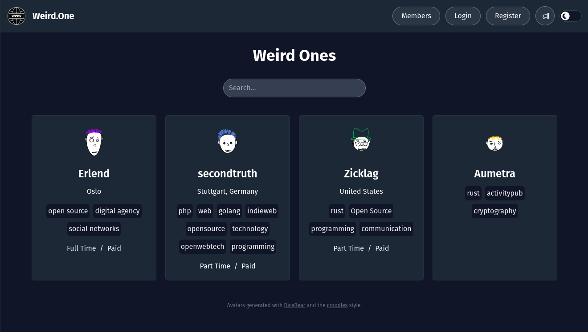

In a way, this article is written prematurely because I don't really _know_ how to make a federated
app. Not for sure anyway. But that's why it's a question! How _do_ you make a federated app? I've
done lots of thinking about it, and collaborated on lots of ideas in the [Commune] group, and I
think now is a good time to share some thoughts and summaries in context.

I'm going to explain some of the challenges involved, and some of the technology that's at our
disposal, in the effort to build a federated app. This is the "state of federation in my head right
now".

This post is motivated by the work I'm doing on the [Weird] project with the [Commune] organization.
Weird is an app to help you find other people that you might want to work with or connect to, and to
help you build a "Shared Network of Purpose". Federation between Weird instances is something that
we've wanted to support, and it's looking like it might be a good idea to think about it earlier
rather than later.

For further context, there is an [open discussion][weird_fed_discuss] about how we're going to
implement federation in Weird, so feel free to come and share your thoughts!

[Weird]: https://github.com/commune-os/weird
[weird_fed_discuss]: https://github.com/commune-os/weird/discussions/49
[commune]: https://github.com/commune-os

## What is Federation?

First off, what is federation? Federation, in a software context, is the concept of linking together
multiple servers, or users, or instances, in a way that you can communicate from one person to
another, even if they are on a different instance.

Email is the most common example of federation: even if you have a GMail account, `john@gmail.com`,
Jane can still Email you from `jane@outlook.com`.

Federation is really cool, because it means that anybody can run their own email server if they want
to, and have control over their own data.

This is in contrast to things like Twitter or Facebook ( I'm not using their new names 😝 ), where
there is only one Twitter, and it's impossible to run your own Twitter server while still being able
to chat with people on the main Twitter server.

## Popular Solutions

So federation is cool, but how do you do it? The most popular solution right now is to use
[ActivityPub]. ActivityPub is an open [internet standard][apstandard] that has been largely
popularized by [Mastodon], an Open Source micro-blogging platform.

ActivityPub basically provides a way for servers to send messages to each-other kind of like
mailboxes. It also lets you do things like following people, by requesting that they send a message
to your mailbox every time they make a new post. This has allowed Mastodon to make something quite
Twitter-like, while still allowing people to run their own servers and own their data.

ActivityPub and Mastodon, though, are far from perfect. There are lots of articles about the state
of things, but [this post][mastodon_notes] about setting up your own single-user Mastodon instance
mentions a lot of the shortcomings.

Here are some important things that stand out to me as missing. It's worth noting that some of this
is more of a Mastodon weakness than an ActivityPub weakness, but I think both have their fair share
of weakness for our purposes:

- There's no standard way to migrate your data from one server to another.
- There's very weak support for having your own domain if you use somebody else's server.
- Replies made on different servers may or may not be visible to you on your server.
- If you _really_ want to own your own data, and run your own server for just yourself, you get a
  sub-par experience.
- There is a massive file duplication problem [described here][mastodon_assets], where many mastodon
  instances are downloading and uploading the _same files_ to s3, for each different mastodon
  server.

In short, while the existing solutions have gotten 80% of the way there, they leave a crucial 20%
left unsolved. A major unfortunate side-effect is that it pushes away the less technical /
freedom-loving normal people, and makes it seem even more like we'll just be stuck with the likes of
major corporations if we want an app that is actually nice to use.

[ActivityPub]: https://activitypub.rocks/
[apstandard]: https://www.w3.org/TR/activitypub/
[Mastodon]: https://joinmastodon.org/
[mastodon_notes]: https://jvns.ca/blog/2023/08/11/some-notes-on-mastodon/
[mastodon_assets]: https://shlee.fedipress.au/2024/call-to-action-fediverse-media-server/

## Alternative Direction

The limitations of existing federation solutions have led to us research alternatives. One thing
prevalent about existing solutions is the dependence on servers. Even though you have the freedom to
choose your server, or run your own, it still requires a server, and all your data is still stuck on
that server.

Wouldn't it be awesome if your data could be stored locally on your own computer, you could author
posts offline, and even host your profile right from home if you wanted, too, just by keeping a tab
open in your browser, or installing a normal app!

Servers could become _optional_. They would be very handy for keeping your data backed up, and for
hosting your public data when your computer isn't on, but they wouldn't need to have any power over
you as a self-sovereign agent on the web.

You could even have multiple servers that keep your data backed up, and you could move from one
server to another easily, because it's all built on data synchronization, not messaging and
mailboxes.

I think this model is still technically "federation", but it's much more peer-to-peer than Email or
Mastodon, for instance. We're envisioning a fediverse of individual agents, not a fediverse of
servers. We want an _agentic fediverse_. ( A term coined with peers in the Commune group. 🤗 )

## Iroh

To that end, we've started using [Iroh], as a foundation for this data synchronization network.
Iroh, is an under-development tool, similar to IPFS, but with mutability built-in. It provides a way
to build a peer-to-peer network, allowing _people_ to connect to _people_ instead of only being able
to connect people to _servers_.

That doesn't mean that servers have to go out the door, though. Servers just become another kind of
peer. Servers can be our robots that help keep our site online when we're not, that act as wires to
help connect people that can't connect directly to each-other. Servers become a tool in the hands of
_people_, as opposed to people becoming a resource exploited by the owner of the server.

In all honesty, maybe I'm playing that up _slightly_ larger than life, but there's still a lot of
truth to the sentiment. The point is that we want to attack these problems of user agency at the
root, if possible. We want to start off by giving users the power of choice and ownership of what
they create. We want to address this in the very nature of our software design, instead of trying to
tack it on as a band-aid to the existing server-controlled architectures that are common today.

<aside style="margin: 0 3em">

**Note:** I want to make it completely clear that not all server-based apps are going to take
advantage of you, and it is possible to do server-based federation in a very secure and
agency-preserving way. [Polyproto] is a great example of such a server-based federation system.

For our offline-first purposes, though, we feel that removing the need for servers opens up a lot
of great possibilities that are difficult or impossible otherwise.

</aside>

[Iroh]: https://iroh.computer/
[Polyproto]: https://docs.polyphony.chat/Protocol%20Specifications/core/

## Incremental Complexity & Superb User Experience

One of the major caveats of _true_ self-sovereignty for users is that it comes with greater
responsibility. For example if you are truly the only one with the power to control your identity,
if you lose your password, nobody can help you recover it, unless you setup some backup or recovery
method yourself. If somebody else could recover it for you, i.e. a server, then the server would
have the power to steal your identity.

But that's kind of how it's always been. The server can reset your password, and in many cases, that
will be the best user experience. The important part is having a _choice_, and being able to change
your mind later.

This highlights an important concept of _incremental complexity_. We want the out-of-the-box user
experience to be super easy. This means that we shouldn't require users to be responsible for
keeping their password safe in a way that they aren't used to, which may leave their identity more
at risk than if Twitter owned it.

The user should be able to sign up, let a server store their identity by default, but later say that
they would like to move that identity a different server or to a local vault. This aspect of being
able to leave has been called _credible exit_.

The user experience for apps, should be **superb**. While federation might be a "feature" to techie
people, it's not for a normal person. It's something a normal person only cares about once Twitter
collapses. Federation is not going to make people use something, usability and true usefulness is
going to make people use something ( if we ignore psychological traps and addiction techniques ).

We've got a lot of competition if we want to beat the convenient, established tools like Twitter. An
app that gives us more freedom shouldn't give us less comfort, unless it is absolutely unavoidable.
To the contrary, the we should have more power to make the app our own, and to make it suite our
personal preferences.

By focusing on providing real value to users, we can beat the big companies who are driven only by
what they can extract from their customer base. Our app shouldn't have to be a downgrade.

## Technical Challenges

Agentic federation definitely has some technical challenges that you don't face in normal
server-based systems. For example, a Mastodon server can use a Postgres database. Postgres works
great, it's an established solution, and it has a lot of resources and techniques that the larger
community and ecosystem has already learned how to take advantage of.

Peer-to-peer networks on the other hand, are still figuring it out. Iroh provides us with eventually
consistent, key-value databases, that are synchronized between peers. You can have multiple
key-value stores, and access to them can be controlled using keys.

The eventually consistent nature makes it perfect for offline-first functionality. Posts you write
will be synced to the rest of the network once you get back online. That would be hard to do in
Postgres.

But the key-value nature of the database also means we have to find new ways of organizing and
indexing our data. There are no SQL queries. Doing simple things that we're used to, like getting
the list of posts with a certain hashtag, become potentially difficult challenges. We may have to
maintain our own indexes, since Postgres isn't there to do it for us.

We also have to figure out how to store structured data and represent relationships with only keys
and values at our disposal.

These challenges, I believe, are absolutely things that can be overcome, but there isn't a lot of
prior art. It's also easy for developers to get [nerd sniped](https://xkcd.com/356/) and lose focus
working on fascinating technical problems without satisfying real-life needs.

The point is, we need to understand that there are going to be things to overcome, and they may be
difficult, but that doesn't mean it can't be done. There are many difficult challenges in everyday
apps, we are just used to solving them already. We need to focus on our real-life use-cases, and be
pragmatic and collaborative to try and come up with lasting, useful solutions.

## Technical Details

Finally, for some technical details. In Weird, we have already started using Iroh, even though it's
not federated yet. We use an Iroh key-value store as our server's database. Right now we are storing
a simple set of profile information for each of our users.



Since directly using the key-value store is cumbersome, we created a graph database wrapper around
it. This allows us to store linked data and access it easily with a Rust API.

While this makes it easier to use the key-value store, it doesn't answer questions around indexing
and federation.

### Multiple Weird Instances

Starting out, we knew that we wanted you to be able to do some sort of federation between Weird
instances, but we still don't know exactly what that should look like. We didn't think we'd need
it immediately, but we unexpectedly ended up running to Weird instances already.

[Weird.One] is going to be a kind of quirky, fun internet page site. But we are also running a
separate instance for the [Buddhist foundation of Norway][bf] to help them find other practitioners
of [right livelihood][rl]. These sites both have distinct flavors. While maybe we want to lean into
weird and eccentric stuff for Weird.One, that could just be distracting for the Buddhist foundation
members.

The distinction between the two instances is something that should be maintained into the future,
but we don't want to divide our network of shared purpose at the boundaries between sites.

This has pushed us to look into federation earlier than we initially thought.

[Weird.One]: https://weird.one
[bf]: https://buddhistforbundet.no/language/english/
[rl]: https://en.wikipedia.org/wiki/Noble_Eightfold_Path#Right_livelihood

### A Global Network of Shared Purpose

Our MVP for "Network of Shared Purpose" is that you need to be able to create a simple user
profile, with a bio, some links, and self-selected tags. These tags serve to help you find others
who have the same interests, skills, etc., that you might want to connect with.

It's pretty simple, but already we run into challenges with agentic federation.

### Indexing

Our key-value/graph store makes it easy to follow links between data in one direction, similar to
primary keys in a SQL database. For example, when I read a user profile, all of the fields of the
user profile, in the key-value database, have the same prefix. For example:

```rust
Key:                                            Value:
["profiles", "MyUniqueID", "bio"]                 =>  "Open source rust developer."
["profiles", "MyUniqueID", "tags"]                =>  Map  // This means "tags" is a mapping.
["profiles", "MyUniqueID", "tags", "Open Source"] =>  1    // Only the tag key really matters to us
["profiles", "MyUniqueID", "tags", "Rust"]        =>  1    // so the value can just be 1.
```

I'm able to list all of the key-value pairs that start with `["profiles", "MyUniqueID", "tags"]` to
get all the tags that zicklag has added to his profile.

Also, since each user can set their own profile info, and not anybody else, the profile must be
stored in a namespace that only the user has write access to. This gives the user ownership of their
profile data. Not even the server can change the user's profile info.

When all the user accounts specify their own tags, though, we run into a challenge when trying to
get the list of all users that have the `Rust` tag. Now we really wish we had an index.

Currently the only way to find all the users with the Rust tag is to go and search through every
known user and see if they've got the Rust tag. This could be very slow, once you grow to lots of
users. What we need is a way to go backwards, and look up users from tags.

### Global Tag Index

My thought on how to handle this is to have a shared, global tag index. It would look like this:

```rust
Key:                                  Value:
["tags", "Open source", "UniqueID1"]    =>     1
["tags", "Open source", "UniqueID2"]    =>     1
["tags", "Rust", "UniqueID2"]           =>     1
["tags", "Rust", "UniqueID3"]           =>     1
["tags", "Rust", "UniqueID4"]           =>     1
```

For each tag, there is a list of user IDs that have that tag. When a user updates the tags on their
profile, the app will additionally add or remove the entries for their user ID in the tags index.

This global tags index will be writable by _everybody_, with a catch.

In Iroh, every edit to a key-value pair by a different author is kept in it's own "slot". What this
means is that it's impossible for Alice to completely erase any data that Bob wrote to the store.
The Iroh app gets to choose, when reading the data, whether it wants to see the one latest value set
by _any_ author, or whether it wants to see all the latest values set by _each_ of the authors that
have written to that key.

This works perfect for the tag index. For example, say we find these entries in the index:

```rust
["tags", "Rust",        "Bob_1234"] => 1  // Metadata: written by Bob_1234
["tags", "Open Source", "Bob_1234"] => 1  // Metadata: written by Alice_5678
```

We can see that the first entry was added by `Bob_1234` and says that the `Rust` tag applies to
`Bob_1234`. That entry would be accepted because the author matches the entry.

For the second entry, though, we see that `Alice_5678` added the `Open Source` tag to `Bob_1234`.
That doesn't match, so it would be ignored.

This gives us a global index of users that match our tags, _and_ that can't be "tricked" by
malicious users!

It's worth noting that the global tag index, must be kept up-to-date with the tags added to the
user's profile. This is something normally done by the database, but now it must be done by the app.
To be clear, it would be invisible to the user.

I don't think this is a problem, it just means the app has to think a little bit more. Maybe in the
future we can build frameworks that will help take this sort of thing into account, just like we
have all kinds of frameworks for making "normal" apps.

This is all new so there will be some experimenting to see what the best way to do things is.

### Aggregation

Similar to indexing, we have new challenges with aggregation, too. Consider this simple case: we
want to know how many users they are with each tag. Again, a normal database makes this easy, but
now we have to figure out how to do it ourselves.

Similar to indexes, we could go with the naïve approach and loop through all entries that start with
`["tags", "Rust"]`, and just count them to figure out how many users have that tag. But doing this
over and over again, in a long list of tags, could be slow.

One possible solution is to delegate service accounts that would be "trusted aggregators". They
would count the users for each tag, and write an entry that says how many users have that tag. Then
apps could use this pre-calculated value instead of counting the tags themselves.

This actually is reminiscent of AtProto's [App Views][atap], where another service analyzes the data
that is independently created by users and aggregates it for specific application needs.

This has a weakness in that you must trust the aggregator to provide reliable information ( though
in this case tag count isn't really that big of a deal ). The good thing is that the user can still
choose which aggregators it trusts.

One strategy you could use to increase trust in the aggregation results is just to have multiple
independent services do the same aggregation, and make sure that they have the same result. Kind of
like a super dumb version of how blockchains work! If you had only three aggregators, reputation
alone would be some motivation for them to be honest, because if their values were different from
the other two aggregators it would be suspicious and subject them to scrutiny for lying about the
aggregation.

This does have the concern of needing big, centralized aggregators.

To get around the need for large aggregators, you could create aggregator "coalitions". These
aggregator groups would work together to aggregate large amounts of data, each of them taking
responsibility for a portion of the data, before combining the final result. This could be done, for
example, but splitting up the global tag list, and each taking a portion of of the tags, and
providing tag counts for their own portion. I imagine we could build frameworks to facilitate this
kind of cooperation, too.

#### Zero-Knowledge Proofs

There's also one final idea for validated aggregation that could be really interesting: using
[risc0] to create a zero-knowledge proof that the aggregation is correct. This could be done, for
example, by taking a checksum of the key-value data at the time the data was aggregated, counting
the tags on risc0, and creating a proof for for that tag count, for that checksum.

This may not be feasible in the end. It could be computationally too expensive to create proven
aggregations, but it could be worth building a proof-of-concept at some point to test it out.

Zero knowledge proofs might also be useful in other scenarios, even if it doesn't work for all
aggregations at all scales. It's something to keep an eye on.

[atap]: https://docs.bsky.app/docs/advanced-guides/federation-architecture#app-views
[risc0]: https://www.risczero.com/

### Moderation

If anybody can add their profile to this global Shared Network of Purpose, what if they set an
inappropriate image as their avatar? We don't have a centralized server to block the user account
for moderation.

What we can do is have a global moderation index that anybody can use to flag profiles for
moderation. It is then up to each weird instance instance, or the individual user, if they are using
a local app, to choose what kind of flags will hide a user profile.

For example instances could default to trusting the moderation team of Weird.One, and have their
instances automatically hide any profiles flagged by the Weird.One team.

Another instance might want to automatically hide any post that has been flagged by 10 people,
regardless of who the flaggers were. You could even have moderation services provided by 3rd
parties, possibly powered by AI.

Instead of becoming a problem, it actually opens up the possibility for a moderation marketplace,
and allows users to choose for themselves who they trust to censor the network.

### Usernames

I know this is a lot already, but we're not done yet. 😄

If we don't have a single, authoritative server, how do we handle usernames?

There has been interesting research on a [pet names][pn] system that could be worth looking into
more for the long term, but I think for Weird the best short term solution is to delegate to
servers that have DNS names.

For example, the Weird instance running at [Weird.One](https://weird.one) already has a public DNS
name so that you can get to the site. That server can keep it's own Iroh namespace, that only it can
write to, that associates usernames to the public keys of the users. You would add a DNS TXT record
to `Weird.One` that would indicate which Iroh namespace to use for looking up usernames.

For example, if I want to lookup the user profile, `zicklag@Weird.One`, the app would make a DNS TXT
query that looks up `weird-usernames.Weird.One`. The DNS server would return the namespace that
contains all the usernames for `Weird.One`. In that namespace it would look up the `zicklag` key,
and it would find my public key, which can be used to get my profile info.

The cool part about this is that I can claim my username at `Weird.One`, even if I store my profile
data locally on my own server. If I control my key, I can store my data anywhere, but `Weird.One`
can still provide me a friendly username. Or I can even use my _own_ domain! All I'd have to do is
add a TXT record to a domain that I control, and point it to a `Weird.One` username mapping.

If I didn't want to trust `Weird.one` in the future, I could always point my domain back to
something I control.

There's a clear road that provides seamless credible exit, and gradual transfer of control, while
using DNS technology that we already have access to today, to provide nice user handles for
everybody, even in a federated setting.

[pn]: https://spritely.institute/static/papers/petnames.html

## Summary

<div style="text-align: center;">

_Wow_, that was a lot.

Seriously, good job if you got this far.

I didn't mean this to end up so long, but the topics just kept coming.

</div>

As we've seen, even some apparently simple tasks can become more challenging in agentic federation. I
think in many ways it's uncharted territory. Still I believe our group is perhaps uniquely well
positioned to tackle the challenge.

Our concern for users not as "things", but as people, is deeply felt, and there is some really
exciting technology and really cool people getting involved all over the place. I'm excited to see
where it goes. Stay tuned, and feel free to get in touch!

<div style="text-align: center;">

Join the Commune [Discord Server][Discord] or our bridged [Matrix Space][Matrix].

</div>

---

> **Update ( 07/20/2024 ):** Since this post there's been new ideas on how to model data on top of
> Iroh, see the next post, [A Web of Data](./a-web-of-data) for an overview of the high-level
> concepts.

[Discord]: https://discord.gg/3v5xjDAk
[Matrix]: https://matrix.to/#/#home:commune.sh
