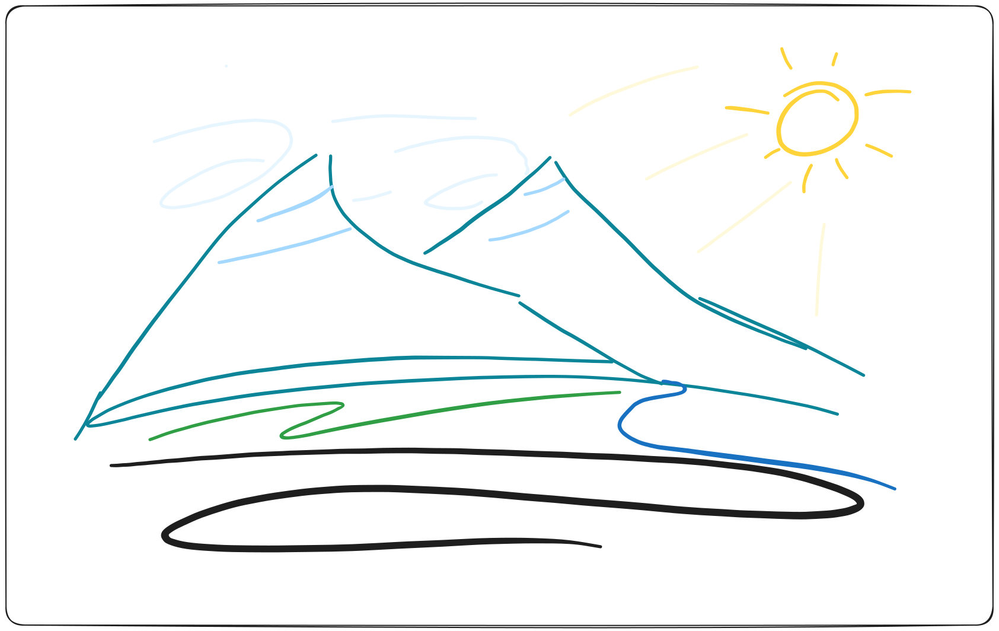

Have you ever heard somebody say something like, "well, AI can't do _this_", or maybe, "a machine
will never be able to do _that_".

I think it's common and natural, when defending our value as humans, to immediately point back to the
things that machines _can't_ do. At the same time, I think that it's kind of backward and the
wrong way to think about it.

The issue is that it predicates our value on something that might not last: we don't know how long
we will be able to do things that machines can't.

Think about it. Art, music, poetry, novels, these are among the highest forms of human expression,
and each one of those things was something that there was _no way_ a machine could do just 100 years
ago.

And maybe they still can't _yet_, but our territory is definitely threatened now. There's no way to
guarantee that machines won't take away our "monopoly" on these things in the future. AI is
challenging our concept of what it means to be human.

And that's where I think we often have the wrong idea. It's not about what AI can't do, it's about
what _humans_ can't do. **Humans can't be replaced.**

When a human dies, there is no way to bring back an equivalent to who they were. All of their life
experiences, everthing that they did or made or knew, nobody with their life will ever live in the
world again. They are unique.

Machines can be copied; they can be replaced, but when I talk to you, a human, I'm talking to
somebody who has lived a life that only you have lived. You have a perspective that nobody else has.
The affect that our conversation has on both of us is not only unique in all the world, but unique
in all of time.

When we make a machine, we tend to value its reproducibility and consistency. It's a machine,
usually we want it to do some task reliably, but that's not what people are for. That not what
_life_ is for!

We live in a confusing time where we are simultaneously making machines more like people, and
treating people more like machines. We are converging on a lukewarm middleground for both humans and
machines where everything is meaningless.

If life was all about getting things done, then we should like to be able to teleport around and
instantly get our tasks done with some magic wand or something. But to do so would be to give up
_living_.

Our lives are fragile, temporary, and except for death, inescapable, and that's partly why we have
some sense of the value of the lives of others.

I think that our art, thoughout all time, has been a big reminder that we are more than just
machines. Our art was an expression of our life experiences, a gift that shared something of who we
are. It's no wonder that to have machines competing with us in this space can feel like an attack on
our humanity.

But as long as the machine can be copied, it can't carry the same weight that a person does. As long
the machine is not _forced_ to live through life, unable to turn off its pain, unable to just flip
a switch and choose to be somebody else, as long as it can do these things that humans _can't_ then
it won't mean as much.

It is our limitations, our hearts that trap our spirits and tie them to this world to feel and
experience things, whether we like it or not, that make us special. And the fact that I can look at
you, another human, and know that you _also_ have the same limitations I have, that _means_ something.

---

So when I talk to you, I want to talk to **you**, not an AI. I don't care if it's perfect or not, I
want it to come from *you* because you are unique. I would rather have a few broken sentences from a
human than a whole essay by an AI.

Not that AI isn't really useful for certain tasks, but don't let it write, or think, or produce
art for you in your name. Don't become the hands and feet of a machine. Live your own life! Your
mistakes are worth more than the AI's "perfection".

Don't judge your own value based on what you can do that the machine, or even other people, can't
do. It's what we _all_ can't do that lets us relate to each-other.

<!-- Over the last 300 years or more machines have been growing in their ability to do things that
previously only humans could do. The things that technology does today would be literally
unimaginable by people just a short time ago. -->

<!-- Technology has been "replacing" humans for specific tasks for a while now. We're humans, and one of
our distinguishing caracteristics is that we make tools. Often, we use our tools to accomplish
things that we can't without them. In modern times, though, many of our machines have replaced jobs
that humans used to do.

For instance, all furniture used to be hand-made. Now robots are responsible for making a huge
portion of our furniture.

---

Often to defend our our value or place as humans, in the face of technology and machines, someone
will say something like, "Well a machine can't do this! There will always be things that only people
can do."

I think that is probably true, but at the same time, I think it's the wrong argument for the value
of humanity, and the fact of the matter is, we don't know that our machines _won't_ be able to
replace us. The technological achievments that the human race has made in the last 100 years would
have seemed completely and entirely impossible 3000 years ago.

_Maybe_ a machine will never be able to do that, but things are changing quickly, maybe machines
_will_ be able to do that. -->
